# KinleyTshering_02240348_DSO101_A1
git@github.com:kinley05/KinleyTshering_02240348_DSO101_A1.git

## Overview
This repository contains assignments for DSO101 - Continuous Integration 
and Continuous Deployment. The project is a full-stack Todo List web 
application built with Node.js/Express backend, SQLite database, and 
HTML/CSS/JS frontend.

## Project Structure
KinleyTshering_02240348_DSO101_A1
 -----.github
      ----workflows
          ----docker.yml
 -----backend
      ----src
          ----app.js
      ----tests
          ----todo.test.js
      ----package.json
      ----Dockerfile
      ----.env.production
 ------frontend/
       ----index.html
       ----Dockerfile
       ----.env.production
 ------.gitignore
 ------Jenkinsfile
 ------render.yaml
 ------README.md

## Tech Stack
Layer                Technology 

Frontend             HTML, CSS, JavaScript 
Backend            Node.js, Express.js 
Database           SQLite 
Containerization   Docker 
CI/CD (Jenkins)    Jenkins Pipeline 
CI/CD (GitHub)     GitHub Actions 
Deployment         Render.com 
Version Control    GitHub 
Testing            Jest, jest-junit 

## Live URLS
Frontend: https://fe-todo-kinley.onrender.com
Backend: https://be-todo-eytb.onrender.com
Health Check: https://be-todo-eytb.onrender.com/health

## API Endpoints
Method    Endpoint    Description 
GET       /todos      Get all todos 
POST      /todos      Add a new todo 
PUT       /todos/:id  Edit or complete a todo 
DELETE    /todos/:id  Delete a todo 
GET       /health     Health check 

# Assignment I - Docker Deployment on Render

## Objective
Build and deploy a full-stack Todo List application using Docker and Render.com.

## Step 1: Application Setup

### Running Locally
cd backend
npm install
npm start
# index.html in browser
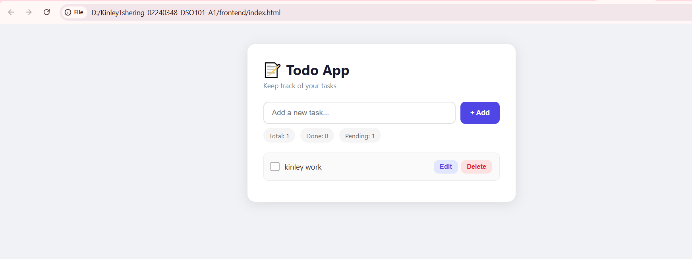

## Part A: Docker Hub Deployment

### Part A: Docker Hub Deployment
Since Docker Desktop was not available locally, GitHub Actions was 
used to build and push Docker images to Docker Hub automatically.

Images pushed:
kinley05/be-todo:02240348
kinley05/fe-todo:02240348

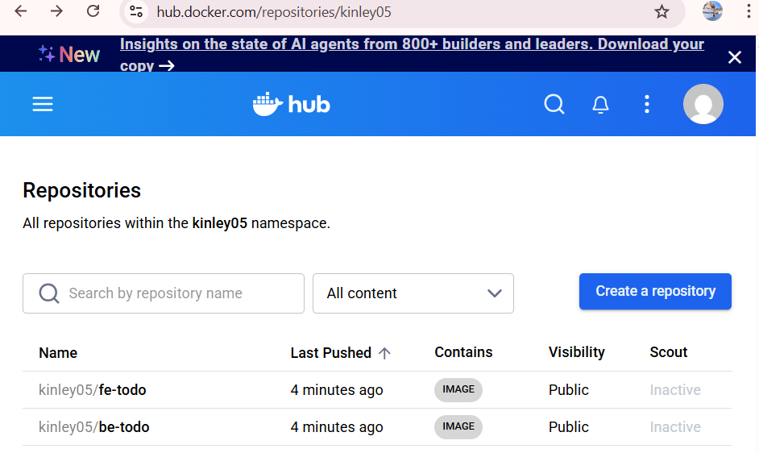
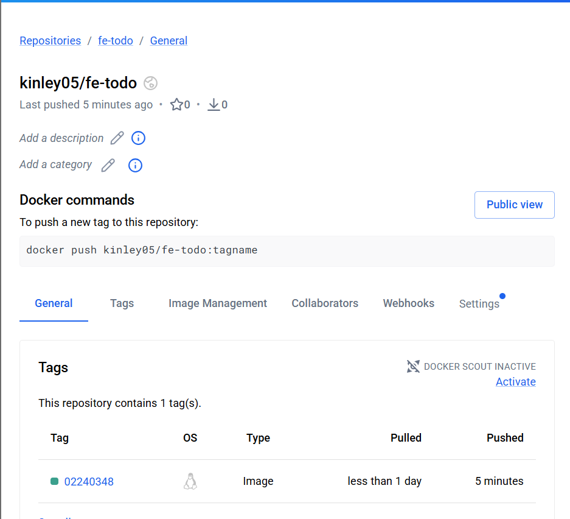
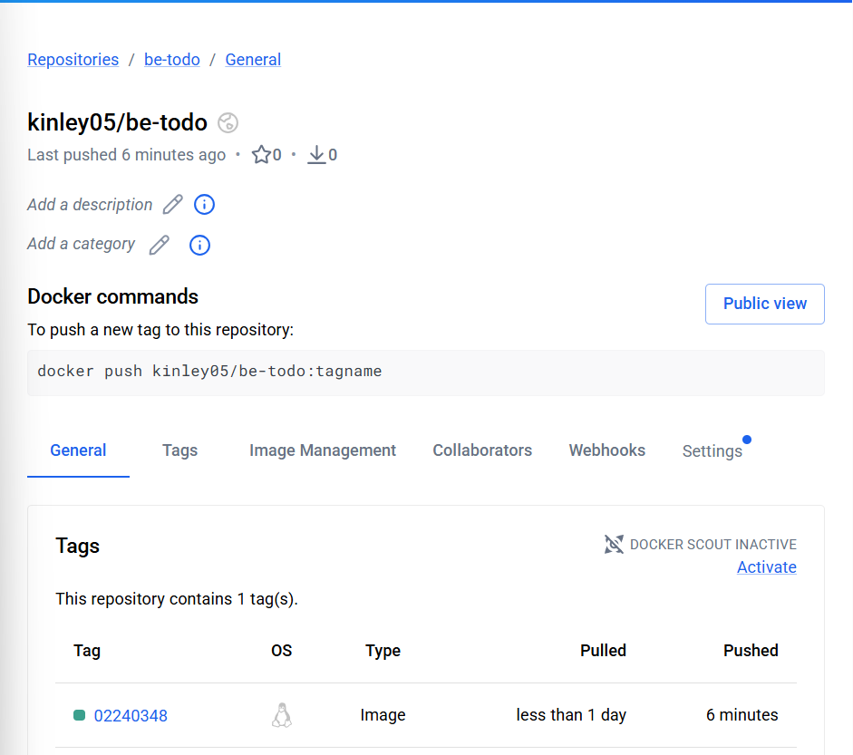

### Render Deployment
Backend:
Service: Web Service
Runtime: Docker
Root Directory: backend
URL: https://be-todo-eytb.onrender.com
Environment Variable: PORT=3000

Frontend:
Service: Static Site
Root Directory: frontend
URL: https://fe-todo-kinley.onrender.com

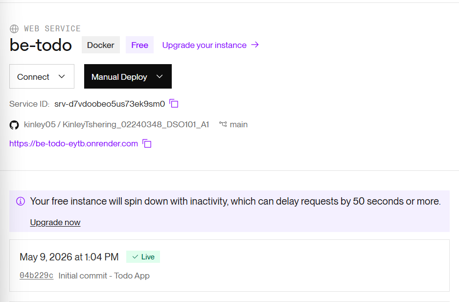
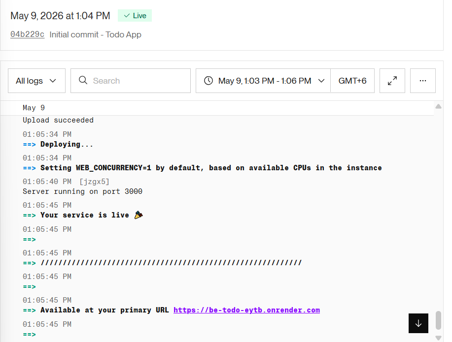
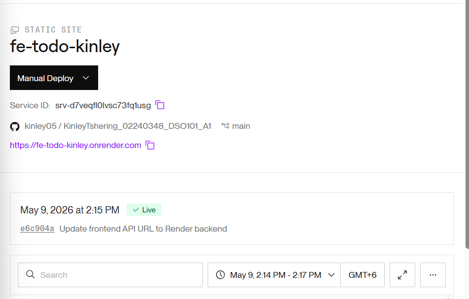
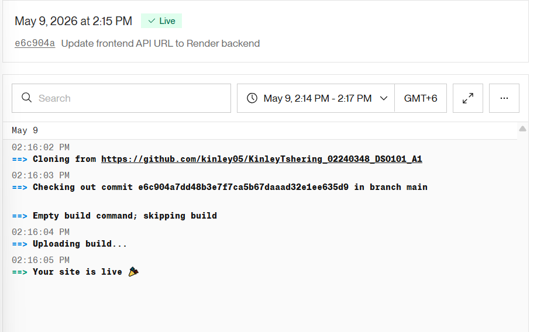

## Part B: Automated Deployment

render.yaml connects GitHub repo to Render for auto-deployment.
Every git push to main triggers automatic rebuild and redeployment.

## Challenges Faced
1. better-sqlite3 required C++ build tools on Windows so switched to sqlite3 package
2. Docker Desktop not available locally so used GitHub Actions to build and push images
3. Render Blueprint required payment so deployed each service manually

# Assignment II - Jenkins CI/CD Pipeline

## Objective
Configure a Jenkins pipeline to automate build, test, and deployment 
of the Todo List application.

## Jenkins Setup
- Jenkins installed and running on localhost:8080
- NodeJS Plugin configured with Node.js LTS v20.x
- GitHub credentials added using Personal Access Token
- Credential ID: kinley

## Pipeline Stages

 Stage      Description 

 Checkout   Pulls code from GitHub 
 Install   Runs npm install in backend/ 
 Build     Runs npm run build 
 Test      Runs Jest tests, publishes JUnit results
 Deploy    Confirms deployment on Render.com 

 ## Jenkinsfile

pipeline {
    agent any
    tools {
        nodejs 'NodeJS'
    }
    stages {
        stage('Checkout') {
            steps {
                git branch: 'main',
                    credentialsId: 'kinley',
                    url: 'https://github.com/kinley05/KinleyTshering_02240348_DSO101_A1.git'
            }
        }
        stage('Install') {
            steps {
                dir('backend') {
                    bat 'npm install'
                }
            }
        }
        stage('Build') {
            steps {
                dir('backend') {
                    bat 'npm run build'
                }
            }
        }
        stage('Test') {
            steps {
                dir('backend') {
                    bat 'npm test'
                }
            }
            post {
                always {
                    junit 'backend/junit.xml'
                }
            }
        }
        stage('Deploy') {
            steps {
                echo 'App is deployed on Render.com via GitHub auto-deploy'
                echo 'Backend: https://be-todo-eytb.onrender.com'
                echo 'Frontend: https://fe-todo-kinley.onrender.com'
            }
        }
    }
    post {
        success {
            echo 'Pipeline completed successfully!'
        }
        failure {
            echo 'Pipeline failed. Check the logs above.'
        }
    }
}

## Test Results
3 tests passing:
- GET /todos returns array
- POST /todos adds a todo
- DELETE /todos/:id deletes a todo

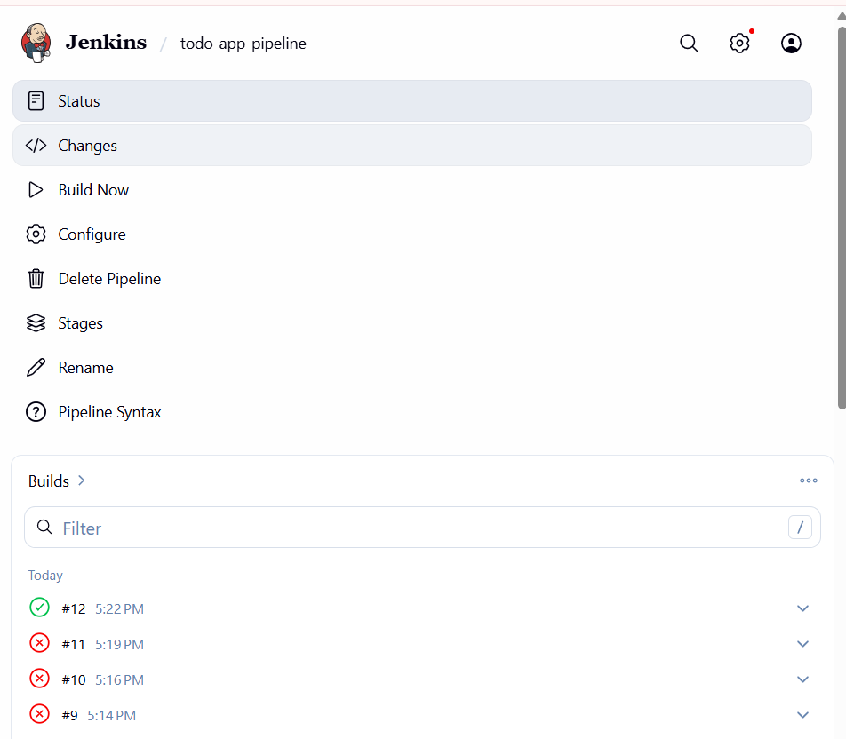
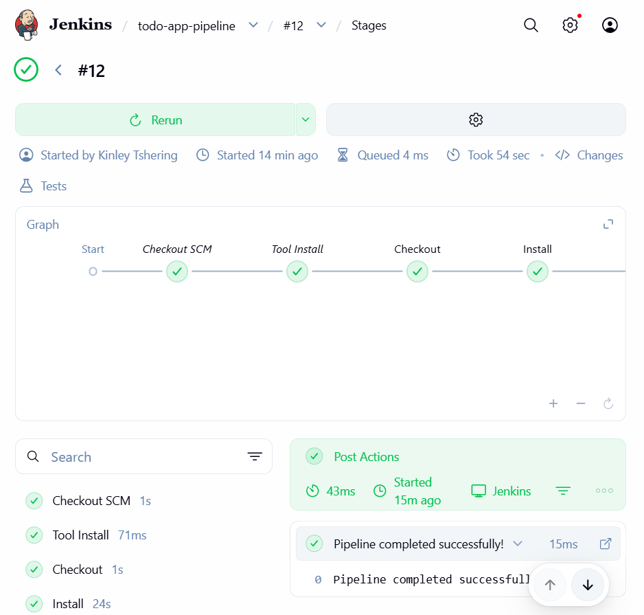
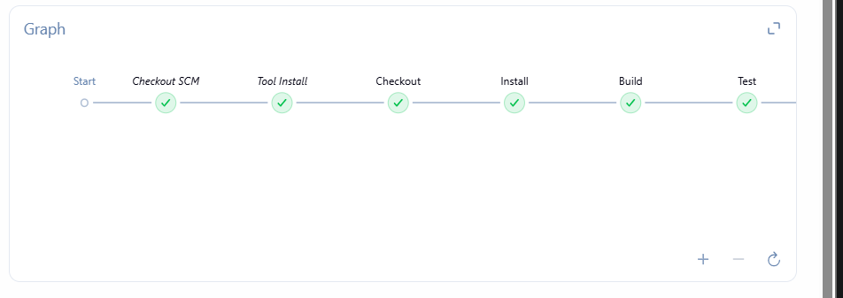
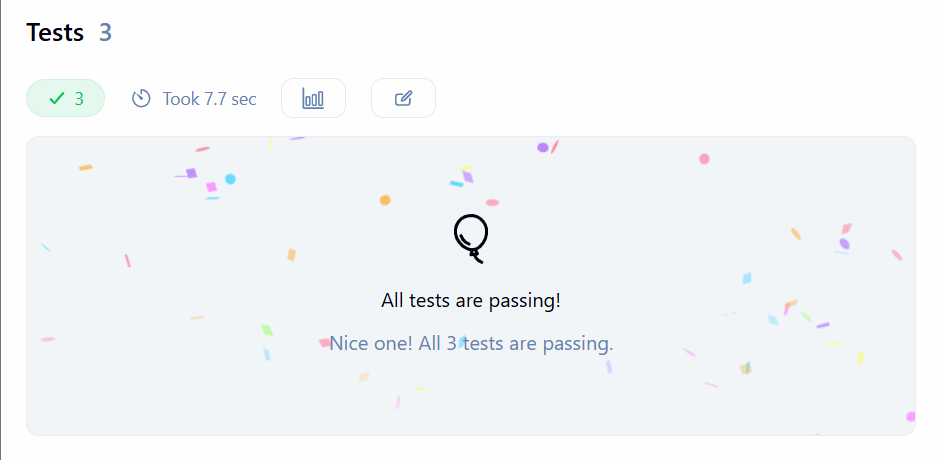

## Challenges Faced
- Jenkins on Windows uses bat instead of sh
- Branch mismatch - changed master to main
- Jenkinsfile capitalization required git mv command
- better-sqlite3 failed on Windows, switched to sqlite3

# Assignment III - GitHub Actions CI/CD

## Objective
Configure GitHub Actions to automatically build Docker images, 
push to Docker Hub, and deploy on Render.com.

## GitHub Actions Workflow (.github/workflows/docker.yml)

name: Build and Push Docker Images

on:
  push:
    branches: [main]

jobs:
  build-and-deploy:
    runs-on: ubuntu-latest
    steps:
      - name: Checkout Repository
        uses: actions/checkout@v4

      - name: Login to DockerHub
        uses: docker/login-action@v3
        with:
          username: ${{ secrets.DOCKER_USERNAME }}
          password: ${{ secrets.DOCKER_TOKEN }}

      - name: Build and Push Backend
        uses: docker/build-push-action@v4
        with:
          context: ./backend
          push: true
          tags: kinley05/be-todo:02240348

      - name: Build and Push Frontend
        uses: docker/build-push-action@v4
        with:
          context: ./frontend
          push: true
          tags: kinley05/fe-todo:02240348

      - name: Trigger Render Deployment
        run: |
          curl -X POST ${{ secrets.RENDER_WEBHOOK_URL }}

## GitHub Secrets Added
- DOCKER_USERNAME
- DOCKER_TOKEN
- RENDER_WEBHOOK_URL

## Full CI/CD Flow
1. Code pushed to GitHub
2. GitHub Actions triggers automatically
3. Docker images built and pushed to Docker Hub
4. Render webhook called
5. Render redeploys automatically

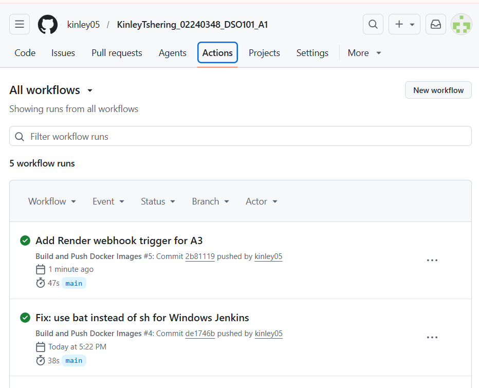
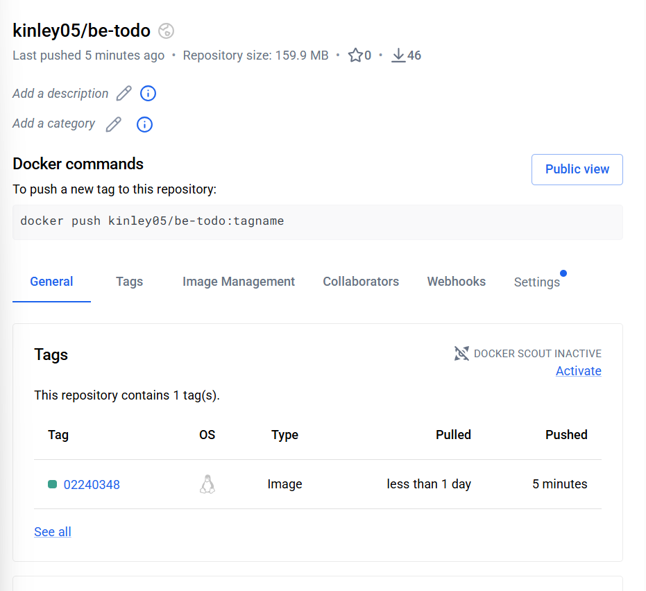
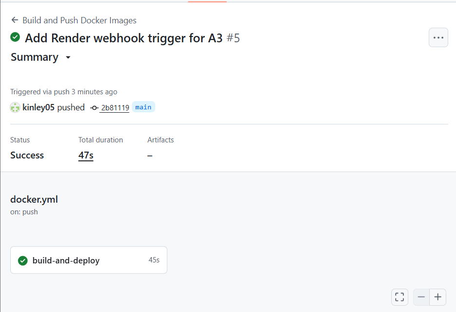
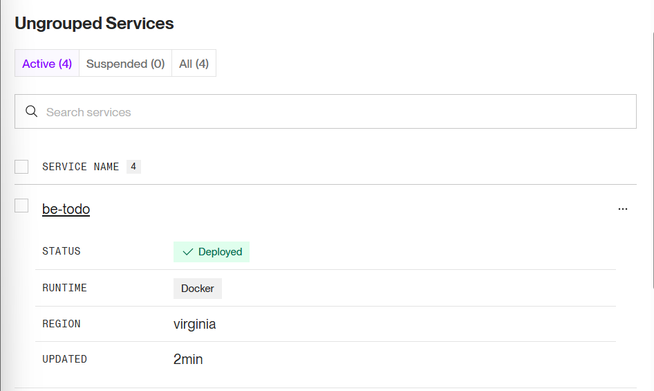

## Challenges Faced
1. Render does not auto-redeploy on Docker Hub push so needed 
  to add webhook trigger in GitHub Actions
2. Had to add RENDER_WEBHOOK_URL as GitHub secret to avoid 
  hardcoding credentials

# Assignment IV - Deploy Web App using GitHub & Render

## Objective
Learn basics of Git, GitHub, CI/CD using GitHub Actions, 
and deployment using Render.

## Application
Full-stack Todo List application with:
- HTML/CSS/JS Frontend
- Node.js/Express Backend
- SQLite Database

## GitHub Actions Workflow
The .github/workflows/docker.yml file automatically:
1. Builds Docker images on every push to main
2. Pushes images to Docker Hub
3. Triggers Render redeployment via webhook

## Deployment on Render
- Frontend (Static Site): https://fe-todo-kinley.onrender.com
- Backend (Web Service): https://be-todo-eytb.onrender.com

## Steps Taken
1. Created GitHub repository
2. Built Todo app with frontend, backend, and SQLite database
3. Created Dockerfiles for frontend and backend
4. Set up GitHub Actions workflow for CI/CD
5. Deployed on Render.com
6. Configured webhook for auto-redeployment

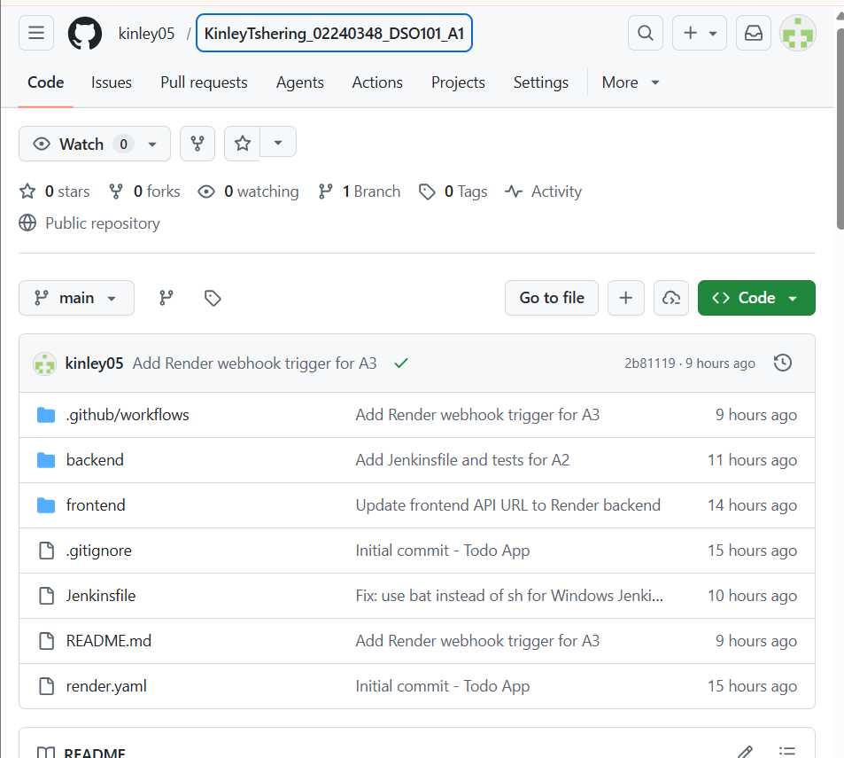
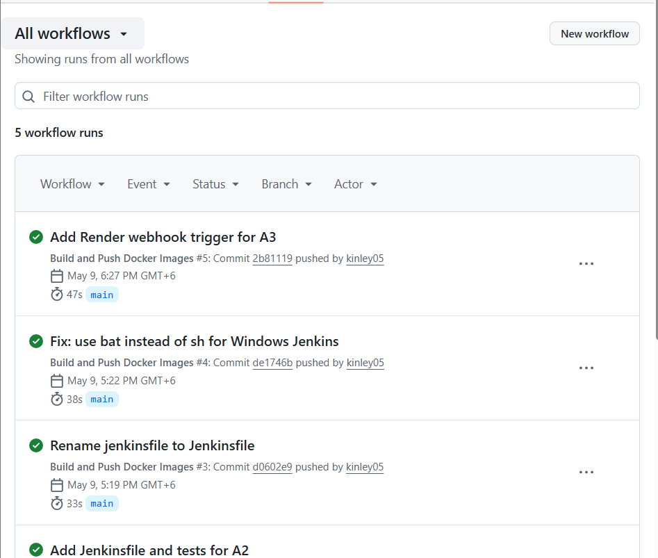
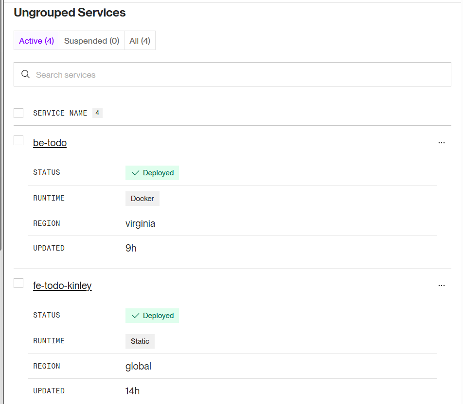
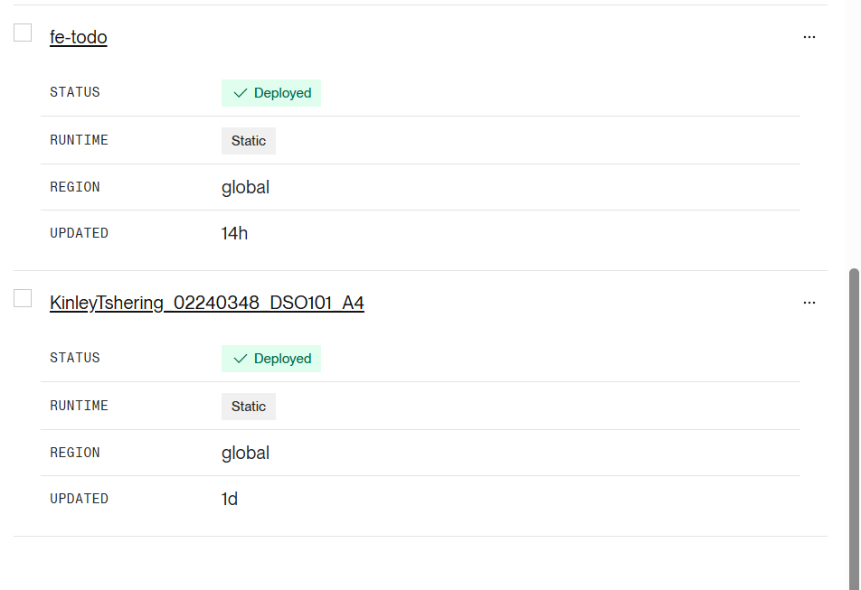
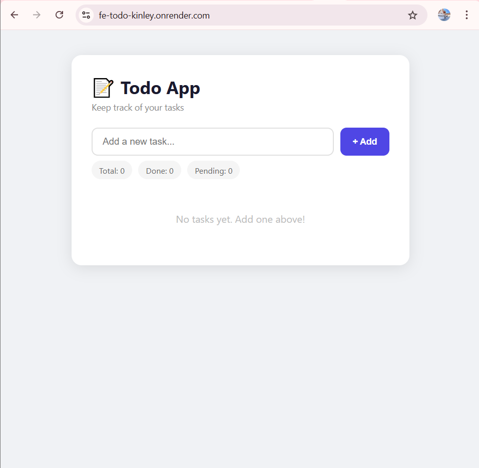

## Learning Outcomes
- Learned how to use Git and GitHub for version control
- Learned how to containerize apps using Docker
- Learned how to set up CI/CD pipelines using GitHub Actions
- Learned how to deploy web applications on Render.com
- Learned how to use webhooks to trigger automatic deployments
- Learned how to store secrets securely in GitHub

## Challenges Faced
- Docker Desktop not available on Windows so used GitHub Actions 
  to build and push images
- Render free tier spins down with inactivity causing delays
- SQLite not available without C++ tools on Windows so used 
  sqlite3 package instead of better-sqlite3

## References
- Docker documentation: https://docs.docker.com
- Render documentation: https://render.com/docs
- Jenkins documentation: https://www.jenkins.io/doc
- GitHub Actions: https://docs.github.com/en/actions
- Jest documentation: https://jestjs.io/docs/getting-started
- SQLite3 for Node.js: https://www.npmjs.com/package/sqlite3